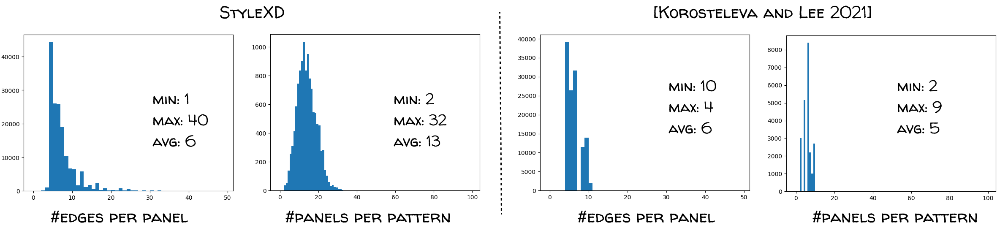

<h2>
&#128518;StyleXD: A Multi-modal Dataset for Fashion Manufacturing</h2>

[Style3D Research](https://linctex.com/)
<!-- views since 24.04 -->

StyleXD is the world's first open, large-scale, multi-model dataset for sewing patterns and digital garments containing over 20,000 garments produced with Style3D Studio. The dataset features each garment with comprehensive design descriptions, accurate structural labels, and multiple-view renderings across various poses and appearances. We invite AI professionals to join us in exploring fashion-related challenges, including pattern parsing, pattern generation, and sketch-based garment reconstruction, among others, and fostering an open, collaborative environment to drive innovation in fashion technology.

## Data Statistics

*Data complexity comparison with [Korosteleva and Lee 2021](https://github.com/maria-korosteleva/Garment-Pattern-Generator). StyleXD has on average 13 panels per garment and 6 edges per panel, while [Korosteleva and Lee 2021](https://github.com/maria-korosteleva/Garment-Pattern-Generator) has on average 5 panels per garment and 5 edges per panel. The distribution histogram also indicates that StyleXD exhibits greater diversity compared to [Korosteleva and Lee 2021](https://github.com/maria-korosteleva/Garment-Pattern-Generator).*

## Maintenance
### Data
Currently we've finish the data desensitization process and open sourced 1204 items over total 23,276 items on [Kaggle](https://www.kaggle.com/datasets/style3d/stylexda-multi-modal-benchmark-of-fashion). We plan to open source the full dataset at the end of this year.

### Benchmarks and Experiments
#### Garment Reconstruction

We have updated the initial experiment code and result in `experiments\garmentrecon`. And we will continue to update the benchmark result.

#### Garment Generation

We have uploaded several experimental results and a demo to `experiments\garmentgen`, hopefully we will open source the code earlier next year, together with a new publication to describe in detail the algorithms. Stay tuned.

#### Garment Assembly

We're currently working on the beta version. Stay tuned.

### Future Features
As StyleXD is a long-term project, we invite researchers to propose new benchmark tasks and experiments using our dataset. Feel free to email us if you have any ideas. 